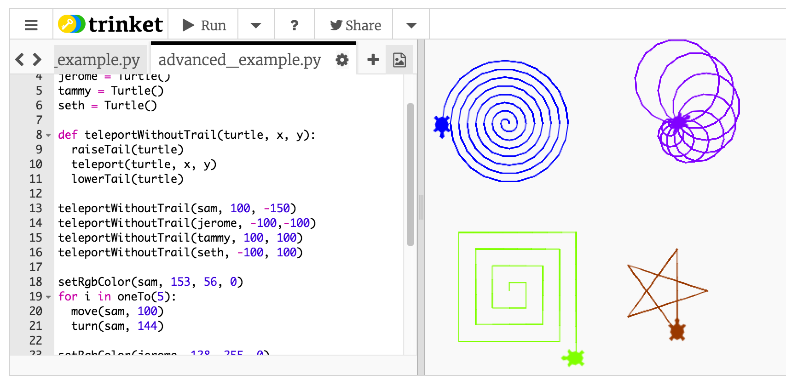

# simple-python-turtles
A simple introduction to programming using python turtle graphics.

# Trinket

Try it out yourself at [trinket.io](https://trinket.io/python/c345d81673)!

# Contents
The Cheatsheet will give you a brief introduction to variables, functions, and loops. It will also teach you about what functions you can use to make a turtle drawing. The `simple_example.py` and `advanced_example.py` files will show how to put them together to draw a picture. You can run this code just by going to the [trinket link](https://trinket.io/python/c345d81673).

# Cheatsheet

## Imports
You can use code that other people have written by 'importing' it into your own code. To work with the turtles, you only have to worry about the `assets.py` file. Make sure you have the following line at the top of your file and you will be all set.
```python
from assets import *
```


## Variables
A variable stores a certain value. Like in math, if `x=5`, then `x+2` is 7. You can also store turtle objects in a variable.
```python
x = 5
myTurtle = Turtle()
```


## Functions
Functions receive 0 or more inputs and perform some operation on them. For instance, the `move` function takes a turtle and a number and makes the turtle move forward by that number of pixels. Functions can also return an output, like the `Turtle` function.

There are a number of functions that are created for you (see Basic Functions and Advanced Functions). You can also create your own functions. (The code inside the function needs to be indented with one tab.)

```python
def myNewFunction(variable1, variable2):
	doStuff(variable1)
	doStuff(variable2)
```

Functions won’t do anything until you call them. Call a function like so:
```python
myNewFunction(15, 4)
```


## Loops
Loops allow you to do something multiple times. (The code inside the loop has to be indented with one tab.)

```python
for countingVariable in oneTo(10):
	doStuff(countingVariable)
```

`countingVariable` will start out with a value of 1, then the code will call `doStuff(1)`, then `countingVariable` will have a value of 2, then the code will call `doStuff(2)`, etc. until `countingVariable` gets to 10.


## Basic Functions

### Turtle()
Creates a new turtle. Usually you store the output to a variable like so.
```python
myTurtle = Turtle()
```

### move(turtle, distance)
Moves a turtle forward by a certain distance.
```python
move(myTurtle, 100)
```

### turnRight(turtle)
Makes a turtle turn 90 degrees to the right.
```python
turnRight(myTurtle)
```

### turnLeft(turtle)
Makes a turtle turn 90 degrees to the left.
```python
turnLeft(myTurtle)
```

### oneTo(n)
Makes a list from 1 to the given number. Used for looping.
```python
for i in oneTo(10):
	print(i)
```

### setColor(turtle, color)
Turns a turtle a different color. Values for color can be 'black', 'red', 'orange', 'yellow', 'green', 'blue', 'purple', or 'pink'.
```python
setColor(myTurtle, 'green')
```


## Advanced Functions

### turn(turtle, degrees)
Makes a turtle turn a certain number of degrees.
```python
turn(myTurtle, 30)
```

### drawCircle(turtle, radius)
Makes a turtle draw a circle of a certain radius.
```python
drawCircle(myTurtle, 30)
```

### drawArc(turtle, radius, degrees)
Makes a turtle draw only a part of a circle with a certain radius.
```python
drawArc(myTurtle, 50, 180)
```

### raiseTail(turtle)
Makes it so a turtle won’t leave a trail until its tail is lowered again.
```python
raiseTail(myTurtle)
```

### lowerTail(turtle)
Makes it so a turtle leaves a trail when moving.
```python
lowerTail(myTurtle)
```

### teleport(turtle, x, y)
Immediately moves a turtle to a certain location. If its tail is down, it will leave a trail.
```python
teleport(myTurtle, 100, 40)
```

### setSpeed(turtle, speed)
Makes a turtle faster or slower. Values for `speed` can be from 1 to 10.
```python
setSpeed(myTurtle, 5)
```

### setRgbColor(turle, r, g, b)
Turns a turtle any color using [RGB colors](http://www.rapidtables.com/web/color/RGB_Color.htm). The values `r`,`g`, and `b` can be between 0 and 255.
```python
setRgbColor(myTurtle, 128, 255, 0)
```

### reset(turtle)
Clears a turtle's drawings, resets its color, and brings it back to the center of the screen.
```python
reset(myTurtle)
```

### delete(turtle)
Removes a turtle from the screen.
```python
delete(myTurtle)
```
